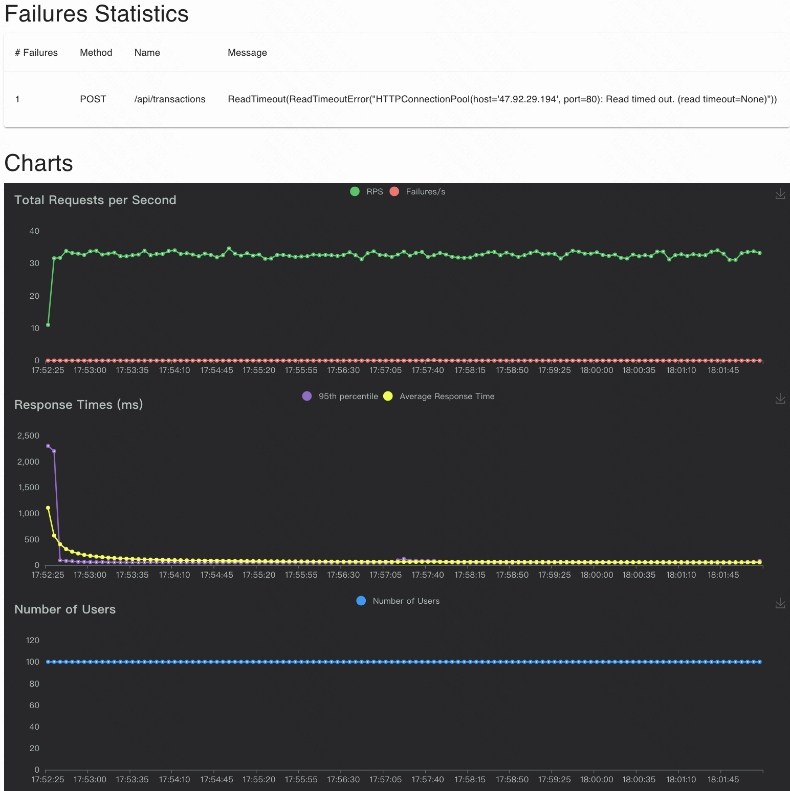

# **交易管理系统**

    HSBC Transaction Management。

## 系统简介

本项目是一个简单的银行交易管理系统，基于Java 21和Spring Boot构建。系统允许用户记录、查看和管理金融交易，支持添加、修改、删除交易记录以及分页显示交易列表。所有数据存储在内存中的 H2 数据库中，无需持久化存储。为提高性能，使用了 Spring Cache 缓存机制。项目遵循 RESTful API 设计原则，具有清晰的 API 结构，同时实现了全面的测试，包括单元测试和压力测试。

### 访问地址
#### 演示环境（阿里云服务器，docker部署）：
swagger访问路径: http://47.92.29.194/api/swagger-ui/index.html#/
#### 本地运行
swagger访问路径: http://localhost:8080/api/swagger-ui/index.html#/


### Docker 容器部署方式
#### 步骤 1：构建 Docker 镜像
在项目根目录下，使用以下命令构建 Docker 镜像：
```sh
docker build -t hsbc-homework-transaction:v1.0 .
```
#### 步骤 2：运行 Docker 容器
使用以下命令运行 Docker 容器：
 ```sh
docker run -d -p 80:8080 hsbc-homework-transaction:v1.0
 ```
其中，-p 8080:8080表示将容器的8080端口映射到主机的8080端口。

### 技术栈
* 编程语言：Java 21
* 框架：Spring Boot
* 数据库：H2（内存数据库）
* 缓存：Spring Cache
* 项目管理：Maven
* 容器化：Docker

### 外部库
* Spring Boot Starter Web：用于构建 RESTful API 和 Web 应用程序。
* Spring Boot Starter Data JPA：简化数据库访问和操作。
* H2 Database：提供内存数据库支持。
* Spring Boot Starter Cache：实现缓存机制。
* Spring Boot Starter Test：用于编写单元测试和集成测试。
* JUnit 5：Java 单元测试框架。
* Mockito：用于模拟对象和行为，辅助单元测试。

### 设计方案
#### 数据库设计
* 使用 H2 内存数据库存储交易记录。
* 交易记录Transaction包含以下字段：

| 属性 | 类型 | 含义 |
| ---- | ---- | ---- |
| id | Long | 交易记录的唯一标识，主键 |
| transactionNo | String | 交易编号，校验交易是否重复 |
| sourceAccountId | Long | 来源账号ID |
| targetAccountId | Long | 收款账号ID |
| amount | BigDecimal | 交易金额 |
| description | String | 交易备注 |
| createTime | Long | 创建时间，ms |
| updateTime | Long| 更新时间，ms |

#### 缓存设计
使用Spring Cache对频繁访问的数据进行缓存，例如交易列表和单个交易信息。缓存策略根据业务需求配置，可提高系统性能和响应速度。
#### 分层架构设计
* Controller层：负责接收客户端请求，调用 Service 层处理业务逻辑，并返回响应结果。
* Service层：实现核心业务逻辑，如交易的创建、修改、删除和查询等。
* Repository层：负责与数据库进行交互，执行数据的增删改查操作。
#### 异常处理和验证
* 在 Controller层统一处理异常，使用 @ControllerAdvice 和 @ExceptionHandler 注解捕获不同类型的异常，并返回相应的错误信息给客户端。
  对各种异常情况进行捕获和处理，如创建重复交易、删除不存在的交易等，并返回友好的错误信息。
* 使用Spring Validation对输入参数进行验证，确保数据的合法性。
#### 分页和查询
支持分页查询交易记录，提高数据查询效率。用户可以根据交易编号进行筛选查询。

### API设计

遵循RESTful API设计原则

#### 交易管理API接口说明

**基础路径**：`/api/transactions`

**通用返回码**
| 返回码 | 含义 |
| ---- | ---- |
| 0 | 成功|
| -1 | 系统错误 |
| 1001 | 参数校验错误 |
| 1002 | 业务错误 |

**1. 分页获取交易记录**

- **请求方式**：GET
- **请求路径**：`/api/transactions`
- **请求参数**：
- | 字段名 | 是否必填 | 描述                          |
    | ---- |------|-----------------------------|
  | `transactionNo` | 否    | 交易编号，用于筛选特定类型的交易记录 |
  | `page` | 否    | 默认值为1，当前页码，用于分页显示交易记录       |
  | `size` | 否    | 默认值为10，每页显示的交易记录数量          |
- **响应内容**：包含交易记录的分页结果。

**2. 根据ID查看交易记录**

- **请求方式**：GET
- **请求路径**：`/api/transactions/{id}`
- **路径参数**：
- | 字段名  | 是否必填 | 描述                           |
        |------|------|------------------------------|
    | `id` | 是    | 交易记录的唯一标识 |
- **响应内容**：包含交易信息的对象。

**3. 创建交易记录**

- **请求方式**：POST
- **请求路径**：`/api/transactions`
- **请求参数**：
- | 字段名 | 是否必填  | 描述 |
  | ---- |-------| ---- |
  | `transactionNo` | 是     | 交易编号，用于防止重复提交 |
  | `sourceAccountId` | 是     | 来源账户ID |
  | `targetAccountId` | 是     | 收款账户ID |
  | `amount` | 是     | 交易金额，需大于 0.01，BigDecimal 类型 |
  | `description` | 是     | 交易备注，长度需在2到30个字符之间 |
- **响应内容**：包含创建成功后的交易信息的对象。

**4. 修改交易记录**

- **请求方式**：PUT
- **请求路径**：`/api/transactions/{id}`
- **路径参数**：
- | 字段名  | 是否必填 | 描述             |
          |------|------|----------------|
  | `id` | 是    | 需要修改的交易记录的唯一标识 |
- **请求参数**：
- - | 字段名 | 是否必填 | 描述 |
    | ---- | ---- | ---- |
    | `sourceAccountId` | 是 | 来源账户 ID |
    | `targetAccountId` | 是 | 收款账户 ID |
    | `amount` | 是 | 交易金额，需大于 0.01，BigDecimal 类型 |
    | `description` | 是 | 交易备注，长度需在2到30个字符之间 |
- **响应内容**：返回修改成功的交易记录的对象，或在发生业务异常时返回错误信息。

**5. 删除交易记录**

- **请求方式**：DELETE
- **请求路径**：`/api/transactions/{id}`
- **路径参数**：
- | 字段名  | 是否必填 | 描述             |
            |------|------|----------------|
  | `id` | 是    | 需要删除的交易记录的ID |
- **响应内容**：在删除成功时返回成功对象，或在发生业务异常时返回错误信息。

---

### 测试
#### 功能测试
* 分页获取交易记录

* 根据ID查看交易记录

* 创建交易记录


* 修改交易记录

* 删除交易记录

#### 单元测试
使用 JUnit 5和Mockito编写单元测试，确保每个API接口的正确性和可靠性。在项目根目录下，使用以下命令运行单元测试：
```sh
mvn test
```


#### 压力测试
* Locust：一个开源的、基于 Python 的性能测试工具，可用于分布式和可扩展的负载测试。它允许用户以类和方法的形式定义用户行为，非常适合模拟多种用户场景。
* Python：作为脚本编写语言，借助其丰富的标准库（如 random 和 string）来生成随机数据，方便模拟真实的业务数据
##### 压测场景(qps=100, 查询接口)
设置numbers of user=100，ramp up=60秒，压测10分钟，根据公式QPS=用户数/平均响应时间，当平均响应时间为1秒时，100个用户并发理论上可以达到 QPS=100。

##### 压测报告



##### 压测场景(qps=100, 创建接口)
设置numbers of user=100，ramp up=60秒，压测10分钟，根据公式QPS=用户数/平均响应时间，当平均响应时间为1秒时，100个用户并发理论上可以达到 QPS=100。

##### 压测报告


## 后续工作

- swagger文档字段含义的完善。
- 缓存使用的SpringCache+Caffeine，后续可以使用redis实现Cache Manager。
- 开发前端页面，实现交易的增、删、改、查。
- 完成更多场景压力测试。
